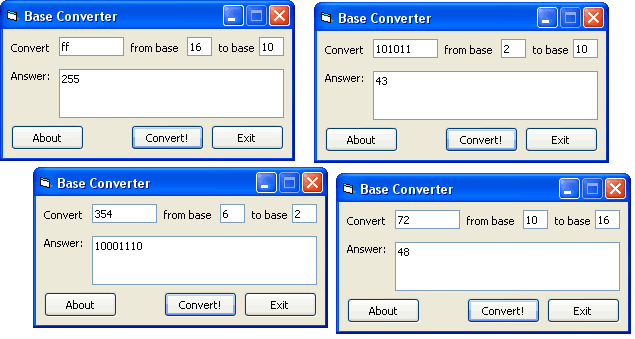



## BaseConv \.\.Again

### Description

[Base Converter] Converts any base to any base. Updated - no bugs & smaller code. Had to post it again cos changing my email seems to have created a new author and deleted my old account, anyway... enjoy.
 
### More Info
 
Value, Old Base, New Base

Value in its new base

No restrictions on the code, e.g. converting FF from base 3 to base 10 will return 255.

             |
---                |---
**Submitted On**   |2003-06-27 16:44:02
**By**             |[Neophyte](https://github.com/Planet-Source-Code/PSCIndex/blob/master/ByAuthor/neophyte.md)
**Level**          |Beginner
**User Rating**    |5.0 (10 globes from 2 users)
**Compatibility**  |VB 5\.0, VB 6\.0
**Category**       |[Math/ Dates](https://github.com/Planet-Source-Code/PSCIndex/blob/master/ByCategory/math-dates__1-37.md)
**World**          |[Visual Basic](https://github.com/Planet-Source-Code/PSCIndex/blob/master/ByWorld/visual-basic.md)
**Archive File**   |[BaseConv\_\_1606456272003\.zip](https://github.com/Planet-Source-Code/neophyte-baseconv-again__1-46089/archive/master.zip)

